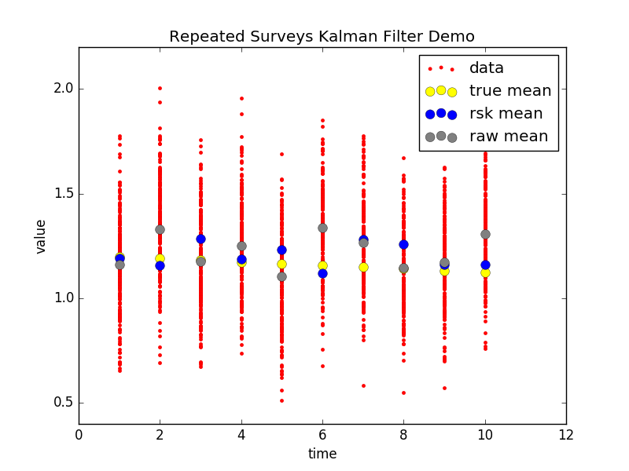

#Repeated Suvery Kalman Filter (RSK)
This project implements the repeated surveys Kalman filter of Jo Thori Lind found in the papers [here](http://folk.uio.no/jlind/papers/DP333.pdf) and [here](http://folk.uio.no/jlind/papers/surveys.pdf).  
It is based on the author's original source written for the Ox language.

## Overview
Suppose we observe a population of individuals at several points in time.  At each point in time, we can measure the mean of a variable of interest in the population.  But if the true mean of the population is changing smoothly and gradually over time, we might imagine that the measurement of a mean at any particular point in time might be improved by considering data from the other observed time slices.  This is the idea behind the Kalman filter--exploit the temporal dynamics to smooth out fluctuations in point-in-time estimates.



See [examples](examples/) for further illustration and applications of the Kalman filter.

## Setup
Installation requires numpy and scipy.  Clone the repo and then run the setup script
```bash
git clone https://github.com/rwalk/rsk
cd rsk
python setup.py install
```
Once the project has stabilized, we'll probably put it up on pypi to make it pip installable.

## Tests
We have a few tests that check the results of our python implementation against the original Ox implementation.
To run these tests, from the root of the project execute:

```bash
python -m unittest
```

## Usage guide

The RSK filter is implemented in the RSK class. Initialize the class with the transition and translation matrices:
```python
from rsk import RSK
rsk = RSK(transition_matrix, translation_matrix)
```
The transmission matrix is an `n_alpha` by `n_alpha` array modelling the transition dynamics of the latent alpha vector.
The translation matrix is an `n_vars` by `n_alpha` array mapping the latent vector `alpha` back into fitted sample means.

To apply the repeated surveys Kalman filter, call `fit` on an RSK instance:
```python
fitted_means = rsk.fit(y, sigma, a0, Q0, Q)
```
The 3D array `y` is the data collected from a repeated survey.  Its shape is:
```
n_periods x n_individuals x n_vars
```

Fitted means is an `n_periods` by `n_vars` matrix containing the means estimated by the RSK algorithm. After `fit` has been applied, the `rsk.alpha` vector and other fitted parameters become available as attributes of the RSK
 instance. 

## Notation guide

| Variable      | Code          | Description  |
| :------------- |:-------------| :-----|
|T|n_periods|Number of point in time measurements|
|N|n_individuals|Number of individuals|
|m|n_vars|Number of observed variables per individual per time slice|
|n|n_alpha|Length of the α vector|
|F|transition_matrix|Markov transition matrix|
|Z|translation_matrix|Translates α into group means μ|
